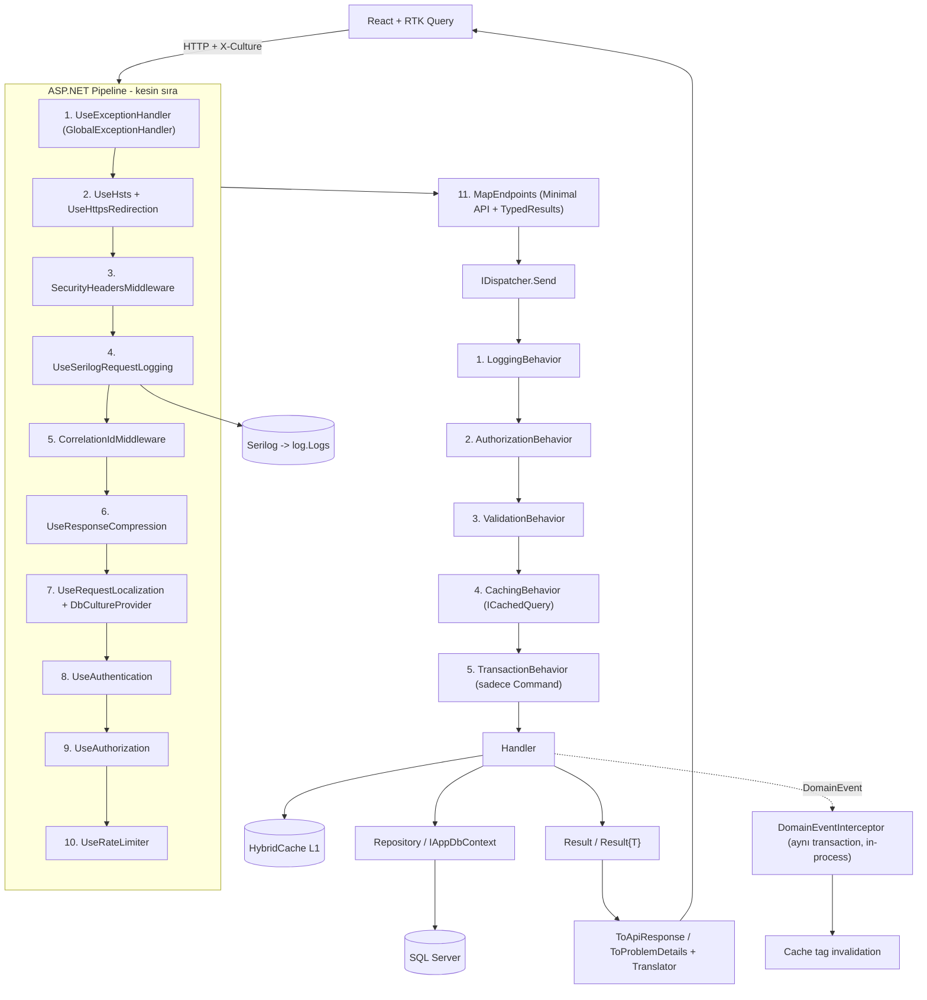

« # .NET 10 + React DDD Monolith Mimarisi (2026)

## 1. Temel Mimari Kararlar

- **Modüler monolith + Clean Architecture**: 5 katman (SharedKernel, Domain, Application, Infrastructure, Api) ve her katmanın içinde **bounded context klasörleri** (`Identity`, `Catalog`, `Localization`). 20 ayrı proje yerine 5 src projesi; ileride mikroservise ayırmak istersen modül klasörü olduğu gibi taşınır.
- **İsimlendirme: prefix yok**. Proje/assembly/kök namespace adı sadece katman adıdır: `SharedKernel`, `Domain`, `Application`, `Infrastructure`, `Api`. Namespace'ler `Domain.Catalog`, `Application.Catalog.Features.Products.Commands.CreateProduct` gibi okunur. Solution: `App.slnx`.
- **Feature vertical slice disiplini**: Bir feature'a ait Command/Query, Handler, Validator ve **kendi Response/DTO'su aynı klasörde** durur. `Mapping/`, `Dtos/`, `Validators/` gibi tip bazlı ortak klasörler yok; tek istisna feature kökündeki `ProductMapper.cs` (Mapperly, o aggregate'in tüm dönüşümleri tek dosyada). Bir feature'ı silmek istediğinde tek klasör silinir, geride yetim dosya kalmaz.
- **CQRS: MediatR yok, kendi dispatcher'ımız**. MediatR v13'ten beri ticari lisanslı. Kendi `IDispatcher` + `IPipelineBehavior` zincirimiz ~120 satır, sıfır lisans riski, delegate cache'li olduğu için MediatR'dan hızlı.
- **Hata yönetimi: Result pattern**, iş akışında exception yok. `Error.Code` aynı zamanda **çeviri anahtarı** (`Product.NotFound`), API sınırında kullanıcının diline çevrilir.
- **Yazma tarafı**: DDD aggregate + `IRepository<TAggregate>` + `IUnitOfWork`. **Okuma tarafı**: `IAppDbContext` üzerinden `AsNoTracking` projeksiyon (gereksiz repository katmanı yok). Bu, DDD'yi bozmadan pragmatik kalır. Sözleşmelerin tam tanımı 7.12'de.
- **Domain event'ler v1'de in-process**: `DomainEventInterceptor`, `SaveChanges` içinde aynı transaction'da dispatch eder. Outbox tablosu v1 kapsamında yok (bkz. Bölüm 11 Backlog) — monolith içinde dış sistem entegrasyonu olmadığı sürece gereksiz karmaşıklık.
- **Cache**: `Microsoft.Extensions.Caching.Hybrid` (L1 = MemoryCache, stampede koruması + tag bazlı invalidation dahil). Üstüne senin istediğin **func tabanlı `ICacheService.GetOrCreateAsync`** ve Scrutor `Decorate` ile **cached repository** sarmalayıcıları. Redis eklemek istersen tek satır L2 kaydı, kod değişmez.
- **Çoklu dil tamamen DB'de**: `Languages` + `TranslationEntries` (UI/mesaj kaynakları) ve aggregate içinde `ProductTranslation` (iş verisi çevirileri). HybridCache ile önbelleklenir, admin çeviri güncelleyince tag ile invalidate olur.
- **Loglama SQL Server'a**: Serilog + `MSSqlServer` sink, async batching, zengin custom kolonlar (TraceId, UserId, Path, StatusCode, ElapsedMs, Culture). Teknik log ile **iş denetim logu (AuditLog)** ayrı: audit, EF `SaveChangesInterceptor` ile yazılır.
- **Auth**: Kendi `Users/Roles/Permissions/RefreshTokens` tablolarımız, Argon2id parola hash'i, 15 dk access token + rotating refresh token (reuse detection), permission-based policy.

## 2. Teknoloji ve Sürümler (hepsi doğrulandı)

Backend: .NET 10 (SDK 10.0.204) · EF Core 10.0.11 · FluentValidation 12.1.1 · Serilog.AspNetCore 10.0.0 · Serilog.Sinks.MSSqlServer 10.0.0 · Microsoft.Extensions.Caching.Hybrid 10.9.0 · JwtBearer 10.0.11 · Scrutor 7.0.0 · Riok.Mapperly 4.3.1 (source-gen mapper, runtime reflection yok) · Scalar.AspNetCore 2.16.20 (Swagger UI yerine) · Konscious.Argon2 1.3.1 · OpenTelemetry 1.17.0 · xunit.v3 3.2.2 · Shouldly 4.3.0 (FluentAssertions v8 ticari oldu) · NetArchTest 1.3.2 · Testcontainers.MsSql 4.14.0 · Aspire 13.4.6 (opsiyonel).

Frontend: Vite 8.2.1 · React 19.2.8 · TypeScript 7.0.2 · @reduxjs/toolkit 2.12.0 + RTK Query · react-redux 9.3.0 · react-router 8.3.0 · tailwindcss 4.3.3 + @tailwindcss/vite · shadcn CLI 4.18.0 · react-hook-form 7.85 + zod 4.4.3 · i18next 26.3.6 + react-i18next 17 + i18next-http-backend 4 · vitest 4.1.10 · Playwright 1.62 · msw 2.15.

Not: TypeScript 7 native derleyici `latest` etiketinde; `typescript-eslint` 8.67 ile uyumsuzluk çıkarsa `typescript@5.9`'a düşeceğiz (tek satır değişiklik).

## 3. Kök Yapı

```
Best-Practice-Project/
├─ App.code-workspace         # Cursor HER ZAMAN bu dosyayla açılır (bkz. 8.3)
├─ AGENTS.md                  # Cursor'un her istekte okuduğu mimari + stil sözleşmesi
├─ .cursor/rules/             # katman bazlı otomatik kurallar (aşağıda)
├─ .editorconfig              # K&R + one-liner C# stili
├─ docs/                      # öğretici rehberler + ADR'ler
├─ backend/
│  ├─ App.slnx                # .NET 10 XML solution formatı (prefix'siz proje adları)
│  ├─ Directory.Build.props   # net10.0, nullable, warnaserror, langversion
│  ├─ Directory.Packages.props# Central Package Management (tüm sürümler tek yerde)
│  ├─ src/ tests/
├─ frontend/
└─ docker-compose.yml         # SQL Server 2025 + seq (opsiyonel)
```

## 4. Backend Klasör Yapısı

```
backend/src/
├─ SharedKernel/                         # sıfır bağımlılık, saf primitives
│  ├─ Primitives/      Entity.cs  AggregateRoot.cs  ValueObject.cs  StronglyTypedId.cs
│  ├─ Results/         Result.cs  Result{T}.cs  Error.cs  ErrorType.cs  ResultExtensions.cs
│  ├─ Events/          IDomainEvent.cs  DomainEventBase.cs
│  ├─ Auditing/        IAuditableEntity.cs  ISoftDeletable.cs  IConcurrencyAware.cs
│  └─ Guards/          Guard.cs
│
├─ Domain/
│  ├─ Identity/
│  │  ├─ User.cs  Role.cs  Permission.cs  RefreshToken.cs  LoginAttempt.cs
│  │  ├─ ValueObjects/ Email.cs  PasswordHash.cs  FullName.cs
│  │  ├─ Events/       UserRegisteredEvent.cs  UserLockedOutEvent.cs
│  │  └─ IdentityErrors.cs                     # Error sabitleri = çeviri anahtarları
│  ├─ Catalog/
│  │  ├─ Product.cs  ProductTranslation.cs  Category.cs  CategoryTranslation.cs
│  │  ├─ ValueObjects/ Money.cs  Sku.cs  Slug.cs
│  │  ├─ Events/       ProductCreatedEvent.cs  ProductPriceChangedEvent.cs
│  │  └─ CatalogErrors.cs
│  ├─ Localization/
│  │  ├─ Language.cs  TranslationEntry.cs
│  │  └─ LocalizationErrors.cs
│  └─ Abstractions/    IRepository.cs  IAggregateRoot.cs
│
├─ Application/
│  ├─ Abstractions/
│  │  ├─ Messaging/    ICommand.cs  IQuery.cs  IRequestHandler.cs
│  │  │                IDispatcher.cs  IPipelineBehavior.cs  RequestHandlerDelegate.cs
│  │  ├─ Caching/      ICacheService.cs  ICachedQuery.cs  CacheEntryOptions.cs
│  │  ├─ Data/         IAppDbContext.cs      # DbSet<T> property'leri expose eder
│  │  │                IUnitOfWork.cs        # SADECE SaveChangesAsync — repository property yok
│  │  ├─ Security/     ICurrentUser.cs  IPasswordHasher.cs  ITokenService.cs
│  │  ├─ Localization/ ITranslationProvider.cs  ITranslator.cs  ICultureContext.cs
│  │  ├─ Events/       IDomainEventDispatcher.cs  IDomainEventHandler.cs
│  │  └─ Time/         IClock.cs
│  ├─ Dispatching/     Dispatcher.cs  CqrsRegistration.cs  HandlerCache.cs
│  ├─ Behaviors/       # kayıt sırası = çalışma sırası, değiştirilemez:
│  │                   LoggingBehavior.cs  AuthorizationBehavior.cs  ValidationBehavior.cs
│  │                   CachingBehavior.cs  TransactionBehavior.cs  PerformanceBehavior.cs
│  ├─ Contracts/       ApiResponse.cs  ApiError.cs  ApiMeta.cs  PagedList.cs
│  │                   PageRequest.cs  SortSpec.cs  FilterSpec.cs
│  ├─ Caching/         CacheKeys.cs  CacheTags.cs      # merkezi anahtar/tag sözlüğü
│  │
│  ├─ Catalog/Features/Products/                       # ÖRNEK: tam slice yapısı
│  │  ├─ Commands/
│  │  │  ├─ CreateProduct/
│  │  │  │  ├─ CreateProductCommand.cs                 # record : ICommand<CreateProductResponse>
│  │  │  │  ├─ CreateProductCommandHandler.cs          # sealed
│  │  │  │  ├─ CreateProductCommandValidator.cs        # AbstractValidator<CreateProductCommand>
│  │  │  │  └─ CreateProductResponse.cs                # output DTO — buraya ait
│  │  │  ├─ UpdateProduct/
│  │  │  │  ├─ UpdateProductCommand.cs
│  │  │  │  ├─ UpdateProductCommandHandler.cs
│  │  │  │  └─ UpdateProductCommandValidator.cs
│  │  │  ├─ DeleteProduct/
│  │  │  │  ├─ DeleteProductCommand.cs
│  │  │  │  └─ DeleteProductCommandHandler.cs          # validator gerekmiyorsa yok
│  │  │  └─ ChangeProductPrice/
│  │  │     ├─ ChangeProductPriceCommand.cs
│  │  │     ├─ ChangeProductPriceCommandHandler.cs
│  │  │     └─ ChangeProductPriceCommandValidator.cs
│  │  ├─ Queries/
│  │  │  ├─ GetProductById/
│  │  │  │  ├─ GetProductByIdQuery.cs                  # record : IQuery<ProductDetailDto>, ICachedQuery
│  │  │  │  ├─ GetProductByIdQueryHandler.cs
│  │  │  │  └─ ProductDetailDto.cs                     # bu query'ye ait DTO — buraya ait
│  │  │  └─ GetProductsPaged/
│  │  │     ├─ GetProductsPagedQuery.cs
│  │  │     ├─ GetProductsPagedQueryHandler.cs
│  │  │     └─ ProductListItemDto.cs
│  │  ├─ EventHandlers/
│  │  │  └─ InvalidateProductCacheHandler.cs
│  │  └─ ProductMapper.cs                              # Mapperly — tüm Product <-> DTO dönüşümleri
│  ├─ Catalog/Features/Categories/                     # aynı Commands/ + Queries/ deseni
│  │
│  ├─ Identity/Features/Auth/
│  │  ├─ Commands/
│  │  │  ├─ Login/         LoginCommand.cs  LoginCommandHandler.cs  LoginCommandValidator.cs  LoginResponse.cs
│  │  │  ├─ Register/      RegisterCommand.cs  RegisterCommandHandler.cs  RegisterCommandValidator.cs  RegisterResponse.cs
│  │  │  ├─ RefreshToken/  RefreshTokenCommand.cs  RefreshTokenCommandHandler.cs  RefreshTokenCommandValidator.cs  RefreshTokenResponse.cs
│  │  │  ├─ Logout/        LogoutCommand.cs  LogoutCommandHandler.cs
│  │  │  └─ ChangePassword/ ChangePasswordCommand.cs  ChangePasswordCommandHandler.cs  ChangePasswordCommandValidator.cs
│  │  ├─ Queries/
│  │  │  └─ GetCurrentUser/ GetCurrentUserQuery.cs  GetCurrentUserQueryHandler.cs  CurrentUserDto.cs
│  │  └─ UserMapper.cs
│  │
│  └─ Localization/Features/Translations/
│     ├─ Commands/
│     │  ├─ UpsertTranslation/    UpsertTranslationCommand.cs  …Handler.cs  …Validator.cs
│     │  └─ ImportTranslations/   ImportTranslationsCommand.cs  …Handler.cs  …Validator.cs
│     ├─ Queries/
│     │  ├─ GetLanguages/         GetLanguagesQuery.cs  …Handler.cs  LanguageDto.cs
│     │  └─ GetResources/         GetResourcesQuery.cs  …Handler.cs  ResourceBundleDto.cs
│     └─ LocalizationMapper.cs
│
├─ Infrastructure/
│  ├─ Configuration/         JwtOptions.cs  DatabaseOptions.cs  CacheOptions.cs  LogOptions.cs
│  ├─ Persistence/
│  │  ├─ AppDbContext.cs  UnitOfWork.cs  Repository.cs
│  │  ├─ Configurations/  Identity/  Catalog/  Localization/    # IEntityTypeConfiguration
│  │  ├─ Interceptors/    AuditableInterceptor.cs  SoftDeleteInterceptor.cs
│  │  │                   DomainEventInterceptor.cs  AuditLogInterceptor.cs  SlowQueryInterceptor.cs
│  │  ├─ Conventions/     StronglyTypedIdConvention.cs  DateTimeOffsetUtcConvention.cs
│  │  ├─ Seed/            LanguageSeeder.cs  TranslationSeeder.cs  PermissionSeeder.cs  CatalogSeeder.cs
│  │  └─ Migrations/
│  ├─ Caching/            HybridCacheService.cs  CacheKeyFactory.cs
│  │                      CachedProductRepository.cs      # Scrutor Decorate
│  ├─ Localization/       DbTranslationProvider.cs  CachedTranslationProvider.cs
│  │                      DbStringLocalizer.cs  DbStringLocalizerFactory.cs
│  │                      DbRequestCultureProvider.cs  Translator.cs
│  ├─ Security/           JwtTokenService.cs  Argon2PasswordHasher.cs  CurrentUser.cs
│  │                      PermissionAuthorizationHandler.cs  PermissionPolicyProvider.cs
│  ├─ Logging/            SerilogBootstrapper.cs  SqlServerLogSchema.cs  Enrichers/
│  ├─ HealthChecks/       CacheHealthCheck.cs
│  ├─ Events/             DomainEventDispatcher.cs
│  ├─ BackgroundJobs/     LogRetentionService.cs  CacheWarmupService.cs
│  │                      # hepsi IDbContextFactory<AppDbContext> kullanır, scope sorunu yok
│  ├─ Time/               SystemClock.cs
│  └─ InfrastructureRegistration.cs
│
└─ Api/
   ├─ Program.cs                       # sadece kompozisyon, ~40 satır
   ├─ Extensions/  ServiceRegistration.cs  PipelineConfiguration.cs  OpenApiSetup.cs
   │               RateLimitingSetup.cs  CorsSetup.cs  HealthCheckSetup.cs
   │               CompressionSetup.cs  OptionsSetup.cs
   ├─ Endpoints/   IEndpoint.cs  EndpointRegistrar.cs  ResultExtensions.cs   # TypedResults eşlemesi
   │  ├─ Identity/ AuthEndpoints.cs  UserEndpoints.cs
   │  ├─ Catalog/  ProductEndpoints.cs  CategoryEndpoints.cs
   │  ├─ Localization/ LanguageEndpoints.cs  ResourceEndpoints.cs
   │  └─ System/   HealthEndpoints.cs                                        # /health/live + /health/ready
   ├─ Middlewares/ CorrelationIdMiddleware.cs  RequestContextLoggingMiddleware.cs
   │               SecurityHeadersMiddleware.cs
   ├─ Handlers/    GlobalExceptionHandler.cs   # IExceptionHandler (.NET 8+)
   ├─ appsettings.json  appsettings.Development.json
   └─ Properties/launchSettings.json

backend/tests/
├─ Domain.UnitTests/                # aggregate davranışları, VO kuralları
├─ Application.UnitTests/           # handler + validator + behavior
│  ├─ Helpers/  FakeCurrentUser.cs  FakeTimeProvider.cs  FakeCacheService.cs  FakeUnitOfWork.cs
│  └─ Catalog/Products/  CreateProductCommandHandlerTests.cs  GetProductByIdQueryHandlerTests.cs …
├─ Api.IntegrationTests/
│  ├─ Infrastructure/  CustomWebApplicationFactory.cs  DatabaseFixture.cs  IntegrationTestBase.cs
│  └─ Catalog/  ProductEndpointsTests.cs   # IClassFixture<DatabaseFixture>, transaction rollback
└─ ArchitectureTests/                # NetArchTest ile katman ihlali build'i kırar
```

Assembly/namespace notu: proje adları prefix'siz olduğu için kök namespace'ler `SharedKernel`, `Domain`, `Application`, `Infrastructure`, `Api` olur. `Directory.Build.props` içinde `<RootNamespace>$(MSBuildProjectName)</RootNamespace>` ve `<AssemblyName>$(MSBuildProjectName)</AssemblyName>` açıkça yazılır; `Api` içinde `Application` adlı tipe çakışma olursa tam nitelikli isim kullanılır (nadir, `global using` ile önlenir).

## 5. Frontend Klasör Yapısı

```
frontend/
├─ vite.config.ts  tsconfig.json  components.json  eslint.config.ts
├─ .env.development  .env.production
└─ src/
   ├─ main.tsx
   ├─ app/
   │  ├─ App.tsx  store.ts  root-reducer.ts  hooks.ts        # typed useAppSelector/Dispatch
   │  ├─ providers/  app-providers.tsx  theme-provider.tsx  i18n-provider.tsx  error-boundary.tsx
   │  │              auth-bootstrap.tsx    # F5 sonrası sessiz refresh, hazır olana kadar splash
   │  └─ router/     router.tsx  routes.ts  protected-route.tsx  guest-route.tsx  permission-gate.tsx
   ├─ shared/
   │  ├─ api/        base-api.ts            # createApi + tagTypes (tek merkez)
   │  │              axios-base-query.ts    # interceptor + 401 refresh mutex
   │  │              api-types.ts           # ApiResponse<T>, ProblemDetails, PagedList<T>
   │  │              problem-details.ts     # sunucu hatasını RHF setError'a map eder
   │  ├─ components/
   │  │  ├─ ui/          # shadcn primitives (button, input, dialog, table, select…)
   │  │  ├─ layout/      app-shell.tsx  sidebar.tsx  topbar.tsx  language-switcher.tsx
   │  │  ├─ data-table/  data-table.tsx  server-pagination.tsx  column-header.tsx
   │  │  └─ form/        form-field.tsx  form-input.tsx  submit-button.tsx
   │  ├─ hooks/      use-debounce.ts  use-permission.ts  use-server-table.ts
   │  ├─ lib/        cn.ts  formatters.ts  storage.ts
   │  ├─ i18n/       index.ts  db-backend.ts        # /api/v1/localization/resources/{culture}
   │  ├─ config/     env.ts  constants.ts
   │  └─ types/      global.d.ts
   ├─ features/
   │  ├─ auth/       auth.api.ts  auth.slice.ts  auth.schemas.ts
   │  │              pages/login-page.tsx  components/login-form.tsx
   │  ├─ catalog/products/
   │  │              products.api.ts        # baseApi.injectEndpoints
   │  │              products.slice.ts      # sadece UI state (filtre, seçim)
   │  │              products.schemas.ts    # zod
   │  │              products.types.ts
   │  │              pages/product-list-page.tsx  product-form-page.tsx
   │  │              components/product-table.tsx  product-form.tsx  product-filters.tsx
   │  └─ localization/  languages.api.ts  pages/translation-manager-page.tsx
   └─ styles/globals.css        # Tailwind v4 @theme inline, CSS değişkenleri
```

Redux ayrımı net: **sunucu verisi RTK Query'de** (cache, dedupe, invalidation), **sadece istemci state'i slice'ta** (auth durumu, tema, dil, tablo filtreleri). Her feature endpoint'lerini `injectEndpoints` ile merkezi `base-api.ts`'e enjekte eder, dairesel import olmaz.

## 6. İstek Akışı



## 7. Çekirdek Tasarım Detayları

### 7.1 Kendi CQRS Dispatcher'ımız

```csharp
public interface ICommand<TResponse> : IRequest<TResponse>;
public interface IQuery<TResponse> : IRequest<TResponse>;
public interface IRequestHandler<in TRequest, TResponse> where TRequest : IRequest<TResponse> {
    Task<Result<TResponse>> Handle(TRequest request, CancellationToken ct);
}
public interface IPipelineBehavior<TRequest, TResponse> where TRequest : IRequest<TResponse> {
    Task<Result<TResponse>> Handle(TRequest request, RequestHandlerDelegate<TResponse> next, CancellationToken ct);
}
```

`Dispatcher`, handler tipini `ConcurrentDictionary<Type, Func<...>>` içinde cache'ler; behavior'ları `Aggregate` ile ters sırada zincirler. Kayıt: `services.AddCqrs(typeof(ApplicationAssembly).Assembly)` (Scrutor taraması). MediatR'ın `IPipelineBehavior` semantiği birebir korunur, geçiş gerekirse maliyet sıfır.

### 7.2 Cache: func tabanlı servis + cached repository

```csharp
public interface ICacheService {
    ValueTask<T> GetOrCreateAsync<T>(string key, Func<CancellationToken, ValueTask<T>> factory, CacheEntryOptions? options = null, string[]? tags = null, CancellationToken ct = default);
    ValueTask RemoveAsync(string key, CancellationToken ct = default);
    ValueTask RemoveByTagAsync(string tag, CancellationToken ct = default);
}
```

- Uygulama: `HybridCacheService` → `HybridCache.GetOrCreateAsync` (L1 MemoryCache, stampede koruması, `RemoveByTagAsync`). `EXTEXP0018` uyarısı `Directory.Build.props`'ta bastırılır.
- **Cached repository**: `CachedProductRepository : IProductRepository` + `services.Decorate<IProductRepository, CachedProductRepository>()` — çağıran kod cache'i bilmez.
- **Deklaratif query cache**: query `ICachedQuery` implement ederse (`CacheKey`, `Expiration`, `Tags`) `CachingBehavior` otomatik devreye girer, handler'a hiç cache kodu girmez.
- Invalidation domain event ile: `ProductPriceChangedEvent` → `InvalidateProductCacheHandler` → `RemoveByTagAsync(CacheTags.Products)`.
- Anahtarlar `CacheKeys.Product(id)` gibi merkezi factory'den; culture duyarlı okumalarda key'e culture eklenir.

### 7.3 DB Tabanlı Çoklu Dil (iki katman)

Kaynak metinler (UI + hata mesajları):
- `localization.Languages` (Id, Code, Name, NativeName, IsDefault, IsActive, SortOrder)
- `localization.TranslationEntries` (Id, LanguageId, Namespace, Key, Value) + unique index `(LanguageId, Namespace, Key)`
- `ITranslationProvider` → `DbTranslationProvider`, üstünde `CachedTranslationProvider` (tag `i18n`, süresiz cache; admin güncelleyince invalidate).
- `DbStringLocalizer : IStringLocalizer` ile `localizer["Product.NotFound"]` çalışır; FluentValidation mesajları da aynı sözlükten gelir (`WithMessage(x => translator["Validation.Required"])`).
- Culture çözümleme sırası: `?culture=` → `X-Culture` header → JWT `culture` claim → `Accept-Language` → DB'deki default dil. Desteklenen diller uygulama açılışında DB'den okunur.
- `GET /api/v1/localization/resources/{culture}` düz sözlük + `ETag`/`Last-Modified` döner; i18next `db-backend.ts` bunu yükler, sürüm damgası ile tarayıcı cache'i kırılır.

İş verisi çevirileri:
- `Product` aggregate'i içinde `ProductTranslations` çocuk koleksiyonu (LanguageId, Name, Description, Slug), `product.SetTranslation(lang, name, desc)` davranışıyla yönetilir.
- Sorgular aktif culture'a göre projeksiyon yapar, yoksa default dile fallback (`COALESCE` mantığı tek query'de).

### 7.4 SQL Server'a Loglama

- `Serilog.Sinks.MSSqlServer` → `log.Logs` tablosu; standart kolonlar sadeleştirilir, custom kolonlar: `TraceId`, `SpanId`, `CorrelationId`, `UserId`, `Culture`, `RequestPath`, `RequestMethod`, `StatusCode`, `ElapsedMs`, `ClientIp`, `SourceContext`, `Environment`, `MachineName`.
- `Serilog.Sinks.Async` + periodic batching (500'lük batch, 5 sn), SQL erişilemezse rolling file'a fallback; `TimeStamp`, `Level`, `TraceId` üzerinde index; `LogRetentionService` N günden eskisini partition/batch delete eder.
- `UseSerilogRequestLogging` + `IDiagnosticContext` ile her istek tek satır özet; health check ve statik istekler filtrelenir. Framework log seviyesi `Warning`, uygulama `Information`.
- **AuditLog ayrı**: `AuditLogInterceptor` entity bazında eski/yeni değeri JSON olarak `audit.AuditLogs`'a yazar (kim, ne zaman, hangi alan). Teknik log ile karıştırılmaz.
- OpenTelemetry trace/metric aynı `TraceId`'yi paylaşır, log ile korelasyon kurulur.

### 7.5 Response Modelleri

- Başarı: `ApiResponse<T>(bool Success, T Data, ApiMeta Meta)`; liste uçları `PagedList<T>(Items, Page, PageSize, TotalCount, TotalPages, HasNext)`.
- Hata: **RFC 9457 ProblemDetails** (`type`, `title`, `status`, `detail`, `traceId`, `errors`) — başlık/detay kullanıcının dilinde. Validation hatası `errors` sözlüğünde alan bazlı gelir, frontend doğrudan RHF `setError`'a basar.
- `Result` → HTTP eşlemesi tek yerde: `ErrorType.NotFound→404`, `Validation→400`, `Conflict→409`, `Forbidden→403`, `Unauthorized→401`, `Unexpected→500`.
- **TypedResults zorunlu, `IResult` yasak.** Endpoint'ler `TypedResults.Ok<T>()`, `TypedResults.Created()`, `TypedResults.NotFound()` döndürür; böylece OpenAPI şeması reflection olmadan, derleme zamanı tip bilgisinden üretilir ve dönüş tipi sözleşmesi derleyici tarafından denetlenir.

```csharp
group.MapGet("/{id:guid}", async Task<Results<Ok<ApiResponse<ProductDetailDto>>, ProblemHttpResult>> (Guid id, IDispatcher dispatcher, CancellationToken ct) => {
    var result = await dispatcher.Send(new GetProductByIdQuery(id), ct);
    return result.IsSuccess ? TypedResults.Ok(ApiResponse.Ok(result.Value)) : result.ToProblemDetails();
})
.WithName("GetProductById")
.Produces<ApiResponse<ProductDetailDto>>()
.ProducesProblem(StatusCodes.Status404NotFound)
.RequirePermission(Permissions.Catalog.Products.Read);
```

### 7.6 EF Core 10 / Veri Katmanı

Şemalar modül başına (`identity`, `catalog`, `localization`, `log`, `audit`). Strongly-typed ID'ler convention ile value converter'a bağlanır. `DateTimeOffset` UTC zorunlu, `rowversion` ile optimistic concurrency, soft delete global query filter. Migration'lar Infrastructure'da (`dotnet ef migrations add X -p Infrastructure -s Api`). Seed idempotent: diller, çeviriler, permission'lar, admin kullanıcı, örnek ürünler. Hot path'lerde `AsNoTracking` + projeksiyon + `AsSplitQuery` ve gerektiğinde keyset pagination.

**Bağlantı dayanıklılığı ve factory** (ayarlar `DatabaseOptions`'tan gelir, connection string kodda geçmez):

```csharp
services.AddDbContext<AppDbContext>((sp, options) => {
    var db = sp.GetRequiredService<IOptions<DatabaseOptions>>().Value;
    options.UseSqlServer(db.ConnectionString, sql => {
        sql.EnableRetryOnFailure(maxRetryCount: db.MaxRetryCount, maxRetryDelay: db.MaxRetryDelay, errorNumbersToAdd: null);
        sql.CommandTimeout(db.CommandTimeout);
        sql.MigrationsHistoryTable("__MigrationsHistory", "dbo");
    });
});
services.AddDbContextFactory<AppDbContext>();   // BackgroundService'ler için
```

`LogRetentionService` ve `CacheWarmupService` scoped `AppDbContext` yerine `IDbContextFactory<AppDbContext>` inject eder; singleton BackgroundService içinde scoped servis kullanma hatası yapısal olarak imkânsız hale gelir. Retry açık olduğu için manuel `BeginTransaction` kullanan yerlerde `ExecutionStrategy` ile sarmalama zorunlu (`TransactionBehavior` bunu tek noktada yapar).

### 7.7 Auth

Access token 15 dk (JWT, `permission` claim'leri), refresh token 7 gün, DB'de **hash'li** saklanır, her kullanımda rotate edilir; aynı token ikinci kez kullanılırsa tüm aile iptal (reuse detection). Argon2id hash. 5 başarısız denemede 15 dk kilit (`LoginAttempts`). Tüm süre/anahtar değerleri `JwtOptions`'tan gelir. `PermissionPolicyProvider` sayesinde `.RequirePermission("catalog.products.create")` yazınca policy dinamik üretilir. Frontend: access token bellekte (Redux, localStorage'da değil), refresh token httpOnly cookie; RTK Query `axios-base-query` 401'de mutex ile tek refresh yapar, kuyruğu tekrar oynatır.

**Sayfa yenileme (F5) akışı** — token bellekte tutulduğu için bu adım kritik: sayfa yüklendiğinde Redux'ta access token yoktur, ancak httpOnly refresh cookie tarayıcıda durmaya devam eder. `axios-base-query` ilk korumalı istekte (veya `app/providers/auth-bootstrap.tsx` içindeki açılış çağrısında) token bulunmadığını görür ve otomatik olarak `POST /api/v1/auth/refresh-token` çağırır; cookie `withCredentials: true` ile gönderilir, yeni access token alınır ve Redux'a set edilir, ardından asıl istek tekrar oynatılır. Kullanıcı login ekranına düşmez. Refresh de başarısız olursa (cookie yok/süresi geçmiş/reuse tespit edildi) auth state temizlenir ve `ProtectedRoute` login'e yönlendirir. Bootstrap tamamlanana kadar uygulama bir splash/skeleton gösterir; böylece korumalı route'lar yanlışlıkla "yetkisiz" görünmez.

### 7.8 Strongly-Typed Configuration (IOptions<T>)

Hiçbir yerde `IConfiguration["Jwt:SecretKey"]` gibi raw erişim veya magic string yok. Ayarlar `Infrastructure/Configuration/` altında sınıflara bağlanır ve uygulama açılışında doğrulanır — hatalı config production'da runtime'da değil, **başlangıçta** patlar.

- `JwtOptions` — Issuer, Audience, SecretKey, AccessTokenMinutes, RefreshTokenDays
- `DatabaseOptions` — ConnectionString, CommandTimeout, MaxRetryCount, MaxRetryDelay
- `CacheOptions` — DefaultExpiration, LongExpiration, TranslationExpiration
- `LogOptions` — RetentionDays, BatchSize, BatchPeriodSeconds, MinimumLevel

```csharp
builder.Services.AddOptions<JwtOptions>().BindConfiguration(JwtOptions.SectionName).ValidateDataAnnotations().ValidateOnStart();
builder.Services.AddOptions<DatabaseOptions>().BindConfiguration(DatabaseOptions.SectionName).ValidateDataAnnotations().ValidateOnStart();
builder.Services.AddOptions<CacheOptions>().BindConfiguration(CacheOptions.SectionName).ValidateDataAnnotations().ValidateOnStart();
builder.Services.AddOptions<LogOptions>().BindConfiguration(LogOptions.SectionName).ValidateDataAnnotations().ValidateOnStart();
```

Her sınıfta `public const string SectionName = "Jwt";` sabiti ve `[Required]`/`[Range]` data annotation'ları bulunur. `appsettings.json` bu sınıflarla birebir eşleşir; secret'lar Development'ta User Secrets, production'da environment variable / key vault üzerinden gelir ve repoya girmez.

### 7.8b Veri Erişim Sözleşmeleri: IAppDbContext ve IUnitOfWork

`IUnitOfWork` **sadece** kaydetme sorumluluğunu taşır; içinde repository property'si **olmaz** (klasik "God UnitOfWork" anti-pattern'i). Repository'ler DI'dan ayrı ayrı inject edilir.

```csharp
public interface IUnitOfWork {
    Task<int> SaveChangesAsync(CancellationToken ct = default);
}

public interface IAppDbContext {
    DbSet<Product> Products { get; }
    DbSet<Category> Categories { get; }
    DbSet<Language> Languages { get; }
    DbSet<TranslationEntry> TranslationEntries { get; }
    DbSet<User> Users { get; }
    Task<int> SaveChangesAsync(CancellationToken ct = default);
}
```

`AppDbContext : DbContext, IAppDbContext, IUnitOfWork` şeklinde her ikisini birlikte implement eder; DI'da `IAppDbContext` ve `IUnitOfWork` aynı scoped `AppDbContext` örneğine yönlendirilir (`services.AddScoped<IUnitOfWork>(sp => sp.GetRequiredService<AppDbContext>())`).

**Kabul edilen trade-off**: `IAppDbContext`, `DbSet<T>` expose ettiği için `Application` projesi `Microsoft.EntityFrameworkCore` paketine referans verir. Bu bilinçli ve pragmatik bir tercihtir — alternatifi (her sorgu için repository metodu yazmak) LINQ projeksiyon esnekliğini yok eder ve yüzlerce satır ölü kod üretir. EF Core artık ORM değil bir veri erişim standardı olarak kabul ediliyor; Microsoft'un kendi mimari rehberi de bunu öneriyor. Arch test kuralı bunu şöyle sınırlar: `Application` yalnızca `EntityFrameworkCore` core paketine referans verebilir, **provider** paketine (`SqlServer`) veremez.

### 7.8c Pipeline Behavior Sırası (kesin, değiştirilemez)

`Logging → Authorization → Validation → Caching → Transaction`

Gerekçe önemli: **Authorization, Validation'dan önce gelir**. Yetkisi olmayan bir isteğe validation çalıştırmak boşa iş yapmaktır ve daha kötüsü, validator'lar sıklıkla DB sorgusu içerir (`MustAsync(BeSkuUnique)`) — yetkisiz kullanıcı bu şekilde DB'ye yük bindirebilir ve hata mesajlarından veri varlığı çıkarımı yapabilir. Sıralama zinciri şöyle çalışır:

1. `LoggingBehavior` — en dışta; yetki ve validation reddi de dahil her sonucu görür, correlation/trace scope'unu açar.
2. `AuthorizationBehavior` — `IAuthorizedRequest` implement eden request'lerin permission'ını `ICurrentUser` üzerinden kontrol eder, reddederse zincir burada kesilir (DB'ye hiç gidilmez).
3. `ValidationBehavior` — FluentValidation çalıştırır, hataları `Result.Failure(Error.Validation(...))` olarak döner.
4. `CachingBehavior` — `ICachedQuery` ise cache'e bakar; yetkili ve geçerli isteğin sonucunu önbellekler.
5. `TransactionBehavior` — yalnızca `ICommand` için; `ExecutionStrategy` ile sarmalanmış transaction açar, domain event'ler aynı transaction'da işlenir.
6. `PerformanceBehavior` — en içte, sadece handler süresini ölçer (eşiği aşarsa `Warning` log).

Kayıt sırası DI'da bu sırayla yapılır; `00-architecture.mdc` sıranın değiştirilmesini yasaklar ve arch test bunu doğrular.

### 7.9 Middleware Sırası (kesin, değiştirilemez)

Sıra tesadüfi değil: exception handler en dışta olmalı ki altındaki her şeyi yakalasın; compression localization'dan önce gelir ki çeviri gövdesi de sıkışsın; rate limiter authorization'dan sonra gelir ki kullanıcı/permission bazlı limit uygulanabilsin.

1. `UseExceptionHandler` (GlobalExceptionHandler — en dışta)
2. `UseHsts` + `UseHttpsRedirection`
3. `SecurityHeadersMiddleware`
4. `UseSerilogRequestLogging`
5. `CorrelationIdMiddleware`
6. `UseResponseCompression`
7. `UseRequestLocalization`
8. `UseAuthentication`
9. `UseAuthorization`
10. `UseRateLimiter`
11. `MapEndpoints`

Bu liste `Api/Extensions/PipelineConfiguration.cs` içinde tek metotta, numaralı yorumlarla yazılır; `00-architecture.mdc` kuralı sıranın değiştirilmesini yasaklar.

### 7.10 Health Check: Live vs Ready Ayrımı

Orchestrator (Kubernetes/Aspire) iki farklı soru sorar, tek endpoint ikisini birden cevaplayamaz. `/health/live` bağımlılık sorgulamaz — DB yavaşladığında container'ın gereksiz yere restart edilmesini önler. `/health/ready` ise DB ve cache erişimini kontrol eder, hazır değilse trafik yönlendirilmez.

```csharp
services.AddHealthChecks()
    .AddSqlServer(dbOptions.ConnectionString, tags: ["ready"])
    .AddCheck<CacheHealthCheck>("cache", tags: ["ready"]);

app.MapHealthChecks("/health/live",  new HealthCheckOptions { Predicate = _ => false });
app.MapHealthChecks("/health/ready", new HealthCheckOptions { Predicate = r => r.Tags.Contains("ready") });
```

`CacheHealthCheck` bilinen bir anahtara yaz/oku turu atar. Health endpoint'leri `UseSerilogRequestLogging` filtresiyle log dışında tutulur (gürültü olmasın).

### 7.11 Response Compression

`UseResponseCompression` ile Brotli (öncelikli) + Gzip; `application/json`, `application/problem+json`, `text/plain`, `text/css`, `application/javascript` MIME tipleri dahil; 1 KB altındaki gövdeler sıkıştırılmaz (CPU maliyeti faydayı geçiyor). HTTPS üzerinde sıkıştırma açıkça etkinleştirilir (`EnableForHttps = true`) ve BREACH riski nedeniyle sıkıştırılan yanıtlarda anti-forgery token taşınmaz. Optimal seviye `CompressionLevel.Fastest` (latency dostu).

## 8. Kod Stili ve Cursor Entegrasyonu

`.editorconfig` ile senin istediğin compact stil zorunlu hale gelir:

```ini
csharp_new_line_before_open_brace = none              # K&R
csharp_prefer_braces = when_multiline:suggestion      # if (x) return y; serbest
csharp_style_expression_bodied_methods = true:suggestion
csharp_style_expression_bodied_properties = true:silent
csharp_style_namespace_declarations = file_scoped:warning
dotnet_style_prefer_collection_expression = true:suggestion
max_line_length = 160
```

Örnek hedef stil:

```csharp
public sealed class GetProductByIdHandler(IAppDbContext db, ICacheService cache, ICultureContext culture) : IRequestHandler<GetProductByIdQuery, ProductResponse> {
    public async Task<Result<ProductResponse>> Handle(GetProductByIdQuery query, CancellationToken ct) {
        if (query.Id == Guid.Empty) return CatalogErrors.ProductIdRequired;
        var product = await cache.GetOrCreateAsync(CacheKeys.Product(query.Id, culture.Current), c => db.Products.AsNoTracking().Where(p => p.Id == query.Id).ToResponse(culture.Current).FirstOrDefaultAsync(c), tags: [CacheTags.Products], ct: ct);
        return product is null ? CatalogErrors.ProductNotFound : product;
    }
}
```

Frontend'de Prettier: `printWidth: 120`, `semi: true`, `singleQuote: true`, arrow fonksiyonlar kısa ise tek satır.

### 8.1 AGENTS.md — Zorunlu Bölümler

Kök `AGENTS.md` Cursor'un her istekte okuduğu sözleşmedir ve şu bölümleri **eksiksiz** içerir:

- **Stack (tek bakış)**: katman → proje → temel sorumluluk tablosu (5 src + 4 test projesi).
- **Bağımlılık Yönü**: `SharedKernel ← Domain ← Application ← Infrastructure ← Api` (ok yönü "bağımlı olanı" gösterir). Ters yönde referans arch test tarafından reddedilir.
- **Yasak Listesi**:
  - MediatR (kendi dispatcher'ımız var)
  - AutoMapper (Mapperly kullan)
  - FluentAssertions (Shouldly kullan)
  - magic string (`IOptions<T>` kullan)
  - hardcoded kültür/çeviri string'i (i18n key kullan)
  - exception ile akış kontrolü (Result pattern kullan)
  - `IResult` (TypedResults kullan)
  - handler'da doğrudan `HybridCache`/`DbContext` (`ICacheService`/`IAppDbContext` kullan)
- **Yeni Feature Ekleme — 7 Adım**:
  1. Domain: Entity / VO / DomainEvent / Error sabitleri
  2. Application: Command veya Query klasörü + Handler + Validator + DTO (hepsi aynı klasörde)
  3. Application: Mapper'a yeni metot (`ProductMapper.cs`)
  4. Infrastructure: EF Config + Repository (gerekirse) + Migration
  5. Api: Endpoint metodu + TypedResults + route group'a ekle
  6. Test: Domain unit → Application unit → Integration
  7. Docs: feature için ADR (önemli karar varsa)
- **Cache Key Convention**: `CacheKeys.Product(id)` = `"catalog:product:{id}"`; format `{bounded-context}:{aggregate}:{discriminator}`.
- **Localization Key Convention**: `"Catalog.Product.NotFound"`, `"Validation.Required"`; format `{BoundedContext}.{Entity}.{Durum}` veya `{Katman}.{Kural}`.
- **Cursor'un her ürettiği dosyada kontrol edeceği checklist**:
  - [ ] File-scoped namespace var mı?
  - [ ] Sınıf `sealed` mı?
  - [ ] Primary constructor kullanıldı mı?
  - [ ] Magic string var mı? (CacheKeys, ErrorType, LocalizationKey sabitinden gelmeli)
  - [ ] Exception fırlatılıyor mu? (Result döndür)
  - [ ] Handler'da doğrudan DbContext var mı? (`IAppDbContext` olmalı)
  - [ ] Validator aynı klasörde mi?
  - [ ] Response DTO aynı klasörde mi?
- **Komutlar**: build, test, migration ekleme/uygulama, frontend dev/build/lint komutları.

### 8.2 .cursor/rules/ İçerikleri

- `00-architecture.mdc` (alwaysApply): katman bağımlılık yönü, yasak listesi, middleware sırasının ve pipeline behavior sırasının (Logging → Authorization → Validation → Caching → Transaction) değiştirilemezliği, Result pattern zorunluluğu, prefix'siz proje/namespace adları, `IUnitOfWork`'e repository property eklenmesi yasağı, v1'de outbox yok (in-process domain event).
- `10-csharp-style.mdc` (`backend/**/*.cs`): K&R brace, kısa gövdeler tek satır, primary constructor, file-scoped namespace, `sealed` default, `var` tercih.
- `20-cqrs-slice.mdc` (`backend/src/Application/**`, `backend/src/Api/Endpoints/**`): feature klasörü içinde Command/Query + Handler + Validator + DTO birlikte durur; `Dtos/`, `Validators/`, `Mapping/` klasörü açmak yasak; Mapperly mapper feature kökünde tek dosya; endpoint'lerde **TypedResults zorunlu, `IResult` yasak**, her endpoint `.Produces<T>()` ve `.ProducesProblem(...)` bildirir.
- `30-frontend.mdc` (`frontend/**/*.{ts,tsx}`): RTK Query `injectEndpoints` zorunlu, kebab-case dosya adı, shadcn primitives kullan, hardcoded metin yasak (i18n key), sunucu verisi slice'a kopyalanmaz.
- `40-localization.mdc`:
  - Hardcoded Türkçe/İngilizce string yasak.
  - `Error.Code` değeri aynı zamanda localization key'idir — format `"BoundedContext.Entity.Durum"`.
  - FluentValidation mesajlarında translator kullanılır: `.WithMessage(x => translator["Validation.Required"])`.
- `50-caching.mdc`:
  - Handler'da doğrudan `HybridCache` inject edilmez — `ICacheService` kullanılır.
  - Cache key magic string olmaz — `CacheKeys` sınıfından gelir.
  - Tag invalidation domain event ile tetiklenir; handler içinde `RemoveByTagAsync` çağrılmaz.
- `60-logging.mdc`:
  - Log mesajlarında string interpolation yasak: `Log.Information($"User {id}")` değil, `Log.Information("User {UserId}", id)` (structured logging bozulmasın).
  - Hassas alan loglanmaz: `Password`, `Token`, `CardNumber`, `SecretKey`.
  - Her log satırındaki `SourceContext` enricher tarafından otomatik eklenir, elle yazılmaz.

### 8.3 App.code-workspace (Cursor bununla açılır)

Kök dizindeki `App.code-workspace`, üç kök klasör (`root` = `.`, `backend`, `frontend`) tanımlar ve dil bazlı formatter/lint ayarlarını repoya gömer — böylece takımdaki herkes aynı davranışı alır, kişisel `settings.json`'a bağımlılık kalmaz. **Cursor her zaman bu dosya açılarak başlatılır, tek klasör olarak değil**: `root` klasörü workspace'te bulunmadığında kökteki `.cursor/rules/` ve `AGENTS.md` çözümlenmez, yani mimari kuralları devreye girmez.

```jsonc
{
  "folders": [
    { "name": "root",     "path": "." },
    { "name": "backend",  "path": "backend" },
    { "name": "frontend", "path": "frontend" }
  ],
  "settings": {
    "editor.formatOnSave": true,
    "editor.rulers": [160],
    "files.eol": "\n",
    "dotnet.defaultSolution": "backend/App.slnx",
    "eslint.workingDirectories": ["frontend"],
    "typescript.tsdk": "frontend/node_modules/typescript/lib",
    "[csharp]": { "editor.defaultFormatter": "ms-dotnettools.csharp", "editor.tabSize": 4 },
    "[typescript]": { "editor.defaultFormatter": "esbenp.prettier-vscode", "editor.tabSize": 2 },
    "[typescriptreact]": { "editor.defaultFormatter": "esbenp.prettier-vscode", "editor.tabSize": 2 },
    "[json]": { "editor.defaultFormatter": "esbenp.prettier-vscode" },
    "[jsonc]": { "editor.defaultFormatter": "esbenp.prettier-vscode" },
    "editor.codeActionsOnSave": { "source.fixAll.eslint": "explicit" },
    "files.exclude": { "**/bin": true, "**/obj": true },
    "search.exclude": {
      "**/bin": true, "**/obj": true, "**/node_modules": true,
      "**/dist": true, "**/Migrations": true, "**/package-lock.json": true
    },
    "tailwindCSS.experimental.classRegex": [["cva\\(([^)]*)\\)", "[\"'`]([^\"'`]*).*?[\"'`]"], ["cn\\(([^)]*)\\)", "[\"'`]([^\"'`]*).*?[\"'`]"]],
    "rest-client.environmentVariables": { "local": { "baseUrl": "https://localhost:7001/api/v1" } }
  },
  "extensions": {
    "recommendations": [
      "ms-dotnettools.csdevkit", "ms-dotnettools.csharp",
      "esbenp.prettier-vscode", "dbaeumer.vscode-eslint",
      "bradlc.vscode-tailwindcss", "humao.rest-client",
      "editorconfig.editorconfig", "ms-mssql.mssql",
      "ms-azuretools.vscode-docker", "vitest.explorer",
      "ms-playwright.playwright", "github.vscode-github-actions"
    ]
  }
}
```

Senin listene eklediklerim ve nedenleri:
- `editorconfig.editorconfig` — K&R/one-liner stilinin editörde de uygulanması için (aksi halde `.editorconfig` sadece derleyici analizinde etkili olur).
- `ms-mssql.mssql` — `log.Logs` ve `audit.AuditLogs` tablolarını IDE'den sorgulayabilmek; loglama SQL Server'da olduğu için bu neredeyse zorunlu.
- `vitest.explorer` + `ms-playwright.playwright` — frontend testlerini editörden tek tek koşturmak.
- `github.vscode-github-actions` + `ms-azuretools.vscode-docker` — CI workflow'u ve SQL Server container'ı için.
- `typescript.tsdk` — workspace'in kendi TypeScript sürümünü kullanır (TS 7 kullanacağımız için kritik, editör eski sürüme düşmez).
- `tailwindCSS.experimental.classRegex` — `cn()` ve `cva()` içindeki sınıflarda da Tailwind autocomplete çalışır.
- `search.exclude` içinde `Migrations` — üretilmiş migration dosyaları arama sonuçlarını boğar.

Bilinen kozmetik yan etki: `root` klasörü `backend` ve `frontend`'i zaten içerdiği için explorer'da bu iki ağaç iki kez görünür. Kökte `.vscode/settings.json` ile `files.exclude` verip gizlemek mümkün, ancak o dosya repo tek klasör olarak açıldığında backend/frontend'i tamamen gizler; bu yüzden varsayılan olarak açmıyoruz. Rahatsız ederse `root` klasörünü workspace'ten çıkarmak yerine explorer'da katlanmış tutmak yeterli — `root`'un workspace'te kalması kural çözümlemesi için şart.

`docs/` altında öğretici rehberler: `01-architecture.md`, `02-yeni-feature-ekleme.md` (uçtan uca adım adım), `03-localization.md`, `04-caching.md`, `05-logging.md`, `06-testing.md`, `07-cursor-workflow.md` (hangi prompt hangi işi yapar; ilk satırı "Cursor'u `App.code-workspace` ile aç" uyarısı), `adr/` klasöründe alınan kararların gerekçeleri. README'nin kurulum adımlarının birinci maddesi de workspace dosyasıyla açmak olur.

## 9. Test ve Kalite

- `ArchitectureTests`: Domain'in hiçbir dış pakete, Application'ın Infrastructure'a bağlanamaması; `Application`'ın yalnızca `EntityFrameworkCore` core paketine referans verebilmesi (provider `SqlServer` yasak); handler isimlendirme kuralı; `sealed` zorunluluğu; her Command/Query'nin handler'ıyla aynı klasörde olması; behavior kayıt sırasının beklenen sırayla eşleşmesi — ihlal build'i kırar.
- `Domain.UnitTests`: aggregate invariant'ları ve VO kuralları (bağımlılık yok, hızlı).
- `Application.UnitTests`: handler + validator + behavior testleri. **Mock framework yok**; `Tests/Helpers/` altındaki elle yazılmış fake'ler constructor'dan inject edilir:
  - `FakeCurrentUser` — `ICurrentUser`: UserId, Roles, Permissions dışarıdan set edilir.
  - `FakeTimeProvider` — `IClock`: `UtcNow` testten kontrol edilir (token süresi, lockout senaryoları).
  - `FakeCacheService` — `ICacheService`: in-memory dictionary, `RemoveByTagAsync` gerçekten çalışır (invalidation doğrulanabilir).
  - `FakeUnitOfWork` — `SaveChanges` çağrı sayısı izlenir (gereksiz kayıt/çift kayıt yakalanır).
- `Api.IntegrationTests`: **container başına bir kez, test başına transaction**:
  - `DatabaseFixture` (`IAsyncLifetime`) — Testcontainers SQL Server'ı **bir kez** başlatır, migration + seed uygular.
  - `CustomWebApplicationFactory : WebApplicationFactory<Program>` — connection string'i container'a yönlendirir, dış bağımlılıkları test double'larla değiştirir.
  - Her test sınıfı `IClassFixture<DatabaseFixture>` implement eder; container maliyeti tüm test suite'e yayılır.
  - `IntegrationTestBase` her testte `IDbContextTransaction` açar, teardown'da `RollbackAsync()` yapar — testler birbirinin verisini görmez, DB yeniden oluşturulmaz.
  - Dikkat: `EnableRetryOnFailure` açıkken kullanıcı başlatan transaction `InvalidOperationException` atar. Bu yüzden `CustomWebApplicationFactory` test ortamında `DatabaseOptions.MaxRetryCount = 0` set eder (container yerel, retry'a gerek yok); üretim davranışı etkilenmez.
  - Kapsanan senaryolar: auth akışı (login → refresh → reuse detection), cache invalidation, culture fallback, permission reddi, ProblemDetails formatı.
- Frontend: Vitest + RTL (form/slice), MSW ile API mock, Playwright ile login → ürün oluşturma → dil değiştirme akışı.
- GitHub Actions: build → arch test → unit → integration → frontend lint/test → migration drift kontrolü. Drift adımı, model ile son migration arasında fark varsa pipeline'ı kırar:

```bash
dotnet ef migrations has-pending-model-changes --project backend/src/Infrastructure --startup-project backend/src/Api
```

## 10. Uygulama Sırası

Aşağıdaki todo listesi bu sırayla ilerler; her adım sonunda `dotnet build` / `npm run build` yeşil kalır ve çalışan bir şey elde edersin.

## 11. v1 Kapsamı Dışı (Backlog)

Bilinçli olarak ertelenen, gerektiğinde eklenecek maddeler. Şimdi eklemek karmaşıklık borcu yaratır:

- **Outbox pattern**: v1'de sadece in-process domain event var (`DomainEventInterceptor`, `SaveChanges` içinde aynı transaction'da dispatch). Outbox tablosu ve `OutboxProcessorService` yalnızca dış sistemlerle entegrasyon (message broker, webhook, e-posta servisi, başka bir servise event yayınlama) gerektiğinde eklenecek. Monolith içinde aynı transaction'da çalışan handler'lar için outbox'ın sağladığı "en az bir kez teslim" garantisine ihtiyaç yok; eklendiğinde `IIntegrationEventPublisher` arayüzü domain event dispatcher'ın yanına girer, handler kodları değişmez.
- **Redis L2 cache**: `ICacheService` soyutlaması hazır; tek instance'tan çoklu instance'a geçildiğinde `AddStackExchangeRedisCache` kaydı eklenir, uygulama kodu değişmez.
- **.NET Aspire orchestration**: v1'de `docker-compose` yeterli; Aspire AppHost sonradan iki proje eklenerek devreye alınır.
- **Çok kiracılılık (multi-tenancy)**: aggregate'lerde `TenantId` ve global query filter gerektirir; şu an tek kiracı varsayımı var.
- **Full-text arama**: SQL Server full-text index veya harici arama motoru; v1'de `LIKE` + index yeterli.
»