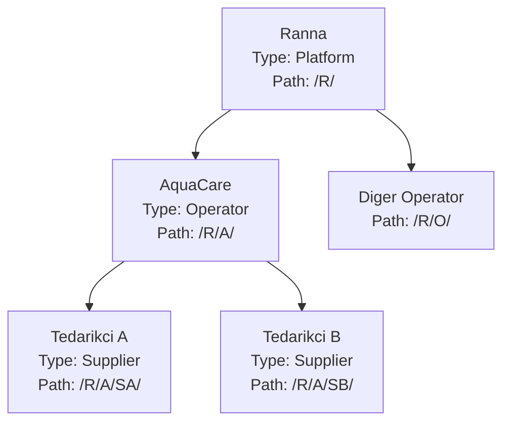

>>>>>>>>>>>>>>>>>>>>>>>>>>>>>>>>>>> SEARCH
# Çok Kiracılı Scope'lu Yetkilendirme Mimarisi

## Neden Bu Model

Mevcut kodda zaten sağlam bir RBAC var: `Permission.Code` (`catalog.products.read`), `RolePermissions` M2M, `PermissionPolicyProvider` ile dinamik policy, JWT'de `permission` claim'leri, frontend'de `PermissionGate`. Eksik olan tek şey **"hangi kayıtlar üzerinde"** sorusunun cevabı.

Bunu `Permission` tablosuna dokunmadan, `RolePermissions` satırına bir `Scope` kolonu ekleyerek çözüyoruz. Yani `aquaculture.sensors.edit` yetkisi tek bir kod olarak kalır; AquaCare admini bunu `Subtree` kapsamında alır (kendi + tedarikçileri), tedarikçi admini `Organization` kapsamında (sadece kendisi), son kullanıcı `Own` kapsamında (sadece kendine atanmış). Rol iskelet, scope ise politika katmanı.

## İsimlendirme Kararı

Sizin "şirket" dediğiniz varlık için **`Organization`** kullanıyorum, `Company` değil:

- Auth0, Okta, Stripe, GitHub hepsi `Organization` kullanır — sektör standardı
- `Company` çok dar: bir tedarikçi şahıs işletmesi veya kooperatif olabilir
- `Tenant` teknik bir terim, domain diline girmemeli (kod içinde "tenant scope" kavram olarak kalır, tablo adı olmaz)

Bounded context: **`Tenancy`**, DB schema: `tenancy`.

Üyelik tablosu için `UserOrganizations` yerine **`Memberships`** — "bu kullanıcı bu organizasyonun üyesi" ifadesini doğrudan taşır ve üzerine metadata (unvan, katılım tarihi, durum) asmak doğal olur.

## Hiyerarşi Modeli



`Organization.Path` materialized path tutar (GUID'lerin "N" formatı, `/` ayraçlı). Subtree sorgusu tek `LIKE 'prefix%'` ile index seek yapar.

**Zarif yan etki:** Ranna kök organizasyon olduğu için "global erişim" ayrı bir bayrak gerektirmez — Ranna'nın subtree'si zaten tüm sistemdir. Global query filter tek kod yoluyla çalışır, platform kullanıcısı için özel dal yok.

## Tablo Şeması

### Yeni: `tenancy` schema

**`Organizations`**
- `Id` (Guid, PK)
- `ParentId` (Guid?, self FK — Ranna için null)
- `Path` (nvarchar(450), materialized path, index)
- `Depth` (int)
- `Type` (`OrganizationType`: Platform / Operator / Supplier)
- `Name` (nvarchar(200)), `Slug` (nvarchar(100), unique)
- `Status` (`OrganizationStatus`: Active / Suspended / Archived)
- `ContactEmail` (Email VO, nullable), `TimeZoneId`, `DefaultCulture`
- `IAuditableEntity` + `ISoftDeletable` (mevcut interceptor'lar otomatik doldurur)

Index: `Path`, `ParentId`, `Slug` (unique), `(Type, Status)`

**`Memberships`**
- `Id` (Guid, PK)
- `UserId` (FK → identity.Users), `OrganizationId` (FK → Organizations)
- `IsPrimary` (bool — login sonrası varsayılan context)
- `Status` (`MembershipStatus`: Active / Suspended / Invited)
- `Title` (nvarchar(100), nullable — "Saha Sorumlusu" gibi görünen unvan)
- `JoinedAt`, `InvitedByUserId`
- audit + soft delete

Unique: `(UserId, OrganizationId)` filtered `WHERE IsDeleted = 0`. Index: `OrganizationId`, `(UserId, IsPrimary)`

**`MembershipRoles`** (composite PK: `MembershipId`, `RoleId`)
- `AssignedAt`, `AssignedByUserId`

Diğer AI'ın önerisinde üyelik ve rol tek tabloda birleşikti. Ayırmamın nedeni: bir kullanıcı aynı organizasyonda birden fazla rol alabilir ("Saha Sorumlusu" + "Raporlama"). Birleşik tabloda `IsPrimary`, `JoinedAt`, `Title` her rol satırında tekrarlanır ve tutarsızlık riski doğar.

### Değişen: `identity` schema

**`Users`** — mevcut yapı korunur, eklenir:
- `SecurityStamp` (Guid) — rol/izin/şifre değişiminde rotate edilir; tüm refresh token family'si revoke olur

**`Roles`** — eklenir:
- `OrganizationId` (Guid?, null = sistem rolü)
- `IsSystemRole` (bool)
- `AllowedClients` (`ClientTypes` flags: Web=1, Mobile=2)

Unique index `Name` → `(OrganizationId, Name)` olarak değişir.

`AllowedClients`, "mobilde Ranna yok" kuralını hardcode etmeden çözer: platform rolleri `Web` olarak seed edilir, login handler client tipini kontrol eder.

**Rol devralma:** `Role.OrganizationId` bir ancestor organizasyon ise alt organizasyonlar o rolü kullanabilir. AquaCare bir rol tanımlar, tedarikçilerine atar — path karşılaştırmasıyla kontrol edilir.

**`Permissions`** — eklenir:
- `Module` (nvarchar(64) — UI'da gruplama: `aquaculture`, `tenancy`, `identity`)
- `MaxScope` (`PermissionScope` — bu izin en fazla hangi kapsamda verilebilir)
- `IsPlatformOnly` (bool — sadece Platform rollerine atanabilir)

**`RolePermissions`** — shadow join entity'den **explicit entity**'ye çevrilir (`Scope` kolonu gerektiği için):
- `RoleId`, `PermissionId` (composite PK)
- `Scope` (`PermissionScope`)

**`PermissionOverrides`** (yeni)
- `Id`, `MembershipId` (FK), `PermissionId` (FK)
- `Effect` (`PermissionEffect`: Allow / Deny)
- `Scope` (Allow için anlamlı)
- `Reason` (nvarchar(256)), `ExpiresAt` (nullable)

Unique: `(MembershipId, PermissionId)`

**`RefreshTokens`** — eklenir:
- `OrganizationId` — token hangi organizasyon context'inde üretildi
- `FamilyId` (Guid) — rotation zincirinin kökü; reuse tespitinde **tüm family revoke** edilir (mevcut kodda sadece tek token kontrol ediliyor)
- `ClientType`, `DeviceId`, `DeviceName`, `CreatedByIp`
- `RevokedReason` (`Rotated` / `Logout` / `ReuseDetected` / `SecurityStampChanged` / `Admin`)

**`LoginAttempts`** — eklenir: `OrganizationId?`, `ClientType`

**`AuditLogs`** (`audit` schema) — eklenir: `OrganizationId?`, `ActorUserId`, `IsImpersonated`, `ClientType`, `CorrelationId`

## Scope Semantiği

```csharp
public enum PermissionScope
{
    Own = 0,           // sadece kendi olusturdugu / kendine atanan kayitlar
    Organization = 1,  // kendi organizasyonu
    Subtree = 2,       // kendi + tum alt organizasyonlar
    Global = 3         // tum sistem (yalnizca Platform org rolleri)
}
```

Çözümleme kuralları:
1. Kullanıcının aktif organizasyondaki tüm rollerinden izinler toplanır
2. Aynı izin farklı scope'larla geliyorsa **en geniş scope kazanır**
3. `PermissionOverrides` Allow → `max(rolScope, overrideScope)`
4. `PermissionOverrides` Deny → izin **tamamen kaldırılır** (deny wins)
5. `Permission.MaxScope` üstünde bir scope atanamaz (validation)

## JWT Claim Yapısı

```
sub        = userId
email      = email
jti        = token id
sstamp     = security stamp
org_id     = aktif organization id
org_path   = aktif organization path
org_type   = Platform | Operator | Supplier
client     = web | mobile
imp        = "1" (yalnizca impersonation context'inde)
permission = "aquaculture.sensors.edit:2"   (cok deger, code:scope)
```

`permission` claim formatı `{code}:{scopeInt}` — mevcut `permission` claim adı korunur, sadece değer zenginleşir. `PermissionAuthorizationHandler` prefix eşleşmesine çevrilir.

JWT boyutu: ~30 izin ≈ 1 KB. İzin sayısı 100'ü aşarsa JWT'den `roles[]` + server-side `IPermissionResolver` + `HybridCache` modeline geçilir; plan bu geçişi engellemeyecek şekilde `IPermissionResolver` soyutlamasını baştan kuruyor.

## Veri İzolasyonu

```csharp
public interface ITenantScoped
{
    Guid OrganizationId { get; }
    string OrganizationPath { get; }  // denormalize, subtree filtresi icin
}
```

Global query filter (`ProductConfiguration.cs`'deki mevcut `HasQueryFilter(x => !x.IsDeleted)` pattern'i genişletilir):

```csharp
builder.HasQueryFilter(x => !x.IsDeleted
    && x.OrganizationPath.StartsWith(tenantContext.OrganizationPath));
```

`OrganizationPath` denormalizasyonu bilinçli bir tercih: `OrganizationId IN (...)` yaklaşımı parametre listesi şişirir ve query plan'i bozar; `LIKE 'prefix%'` tek parametreyle index seek yapar.

`AddDbContextFactory<AppDbContext>` zaten scoped kayıtlı, `ITenantContext` ctor'a inject edilir. Background job'lar için `SystemTenantContext` (kök path) **explicit** verilir — null tenant context sessizce tüm veriyi açmaz, exception fırlatır.

## Organization Switch + Impersonation

Ranna'nın "her şeye müdahale" yetkisi için ayrı bir impersonation endpoint'i **gerekmiyor** — tek endpoint iki senaryoyu çözer:

```
POST /auth/switch-organization  { organizationId, clientType }
```

Yetki kontrolü:
- Kullanıcının o organizasyonda aktif `Membership`'i var mı → normal context switch
- Yoksa: `tenancy.organizations.impersonate` izni `Global` scope'ta var mı → impersonation, token'a `imp=1`, kısa ömür (30 dk), audit'te `IsImpersonated=true`

Yeni access + refresh token üretilir, eski refresh token family revoke edilir.

## Fazlar

**Faz 1 — Tenancy Domain + Organizations**
`backend/src/Domain/Tenancy/` altında `Organization` aggregate (path/depth hesaplayan `CreateRoot` / `CreateChild` factory'leri), `OrganizationType`, `OrganizationStatus`, `TenancyErrors`, domain event'ler. `Schemas.cs`'e `Tenancy` eklenir, `OrganizationConfiguration` yazılır, `OrganizationSeeder` Ranna + AquaCare seed eder.

**Faz 2 — Membership + Scope'lu Permission**
`Membership`, `MembershipRole`, `PermissionOverride` entity'leri. `RolePermission` explicit entity'ye çevrilir + `Scope`. `Role`/`Permission`/`User` alan eklemeleri. `PermissionSet` value object (scope max + deny wins mantığı burada, saf domain kodu — unit test edilebilir).

**Faz 3 — Tenant Context + Veri İzolasyonu**
`ITenantContext` / `TenantContext` (claims'ten okur), `SystemTenantContext`, `ITenantScoped`, `AppDbContext` global filter genişletmesi, `TenantScopeInterceptor` (yazma sırasında `OrganizationId`/`OrganizationPath` otomatik doldurur — `AuditableInterceptor` pattern'i). Catalog entity'leri (`Product`, `Category`) tenant-scoped hale getirilir.

**Faz 4 — Authorization Pipeline**
`Permissions.cs` yeniden yapılandırılır (`Tenancy`, `Identity`, `Aquaculture` modülleri). `IScopedAuthorizedRequest` (`Permission` + `RequiredScope`), `AuthorizationBehavior` scope-aware hale gelir, `PermissionAuthorizationHandler` prefix eşleşmesi, `RequirePermission(code, minScope)` overload'u. `IPermissionResolver` + cache invalidation domain event handler'ları (commit sonrası, AGENTS.md kuralına uygun).

**Faz 5 — Token & Session Sertleştirme**
`JwtTokenService` yeni claim seti. `RefreshToken` family revocation + reuse'da family iptali. `SecurityStamp` rotation. `LoginCommand` + `ClientType` + `OrganizationId?` + `AllowedClients` kontrolü. `SwitchOrganizationCommand`, `GetMyOrganizationsQuery`. `GetCurrentUser` yanıtı organizasyon + scope'lu izin listesi döner.

**Faz 6 — Yönetim API'leri**
Organizations CRUD + tree, Members (ekle/rol ata/askıya al), Roles CRUD + izin atama (scope'lu), Permissions kataloğu (module gruplu). Tümü `TypedResults` + `RequirePermission(code, scope)`.

**Faz 7 — Web Frontend**
`authSlice`: `activeOrganization`, `organizations[]`, `permissions: Record<string, PermissionScope>`. `usePermission(code, minScope?)` hook, `<Can>` component (mevcut `PermissionGate` yerine), header'da organization switcher, `/settings/organizations|members|roles` sayfaları.

**Faz 8 — Mobil**
`AuthContext`'e `permissions`, `activeOrganization`, `hasPermission`, `switchOrganization`. `Can` component. Login'de `clientType: 'mobile'`. Platform kullanıcısı backend'de reddedilir (frontend'de gizlemek yeterli değil).

**Faz 9 — Testler + ADR'lar**
Architecture testleri (`Tenancy` bağımlılık yönü, `ITenantScoped` zorunluluğu). Domain unit (path/depth, `PermissionSet` scope max + deny wins). Application unit (`FakeTenantContext`). **Kritik güvenlik integration testi:** Tedarikçi A'nın kullanıcısı Tedarikçi B'nin verisine erişemez; suspended organizasyon token alamaz; impersonation audit'e düşer.

ADR-004 (multi-tenancy stratejisi), ADR-005 (scope'lu yetkilendirme), ADR-006 (organization switch + impersonation).

## Migration Notu

Mevcut iki migration farklı klasör/namespace'te (`Infrastructure/Migrations/` ve `Infrastructure/Persistence/Migrations/`) — yeni migration'lardan önce tek klasöre toplanmalı, aksi halde EF tooling tutarsız davranır.

Faz başına bir migration: `AddTenancy`, `AddMembershipAndScopes`, `TenantScopeCatalog`, `AuthSessionHardening`.

## Kritik Güvenlik Notu

Frontend/mobil gizleme yalnızca UX'tir. Her endpoint `RequirePermission(code, scope)` ile, her sorgu global query filter ile, her yazma `TenantScopeInterceptor` ile korunur — üç bağımsız katman. Faz 9'daki cross-tenant erişim testi bu garantiyi CI'da sabitler.
=======
# Çok Kiracılı Scope'lu Yetkilendirme Mimarisi

## Neden Bu Model

Mevcut kodda zaten sağlam bir RBAC var: `Permission.Code` (`catalog.products.read`), `RolePermissions` M2M, `PermissionPolicyProvider` ile dinamik policy, JWT'de `permission` claim'leri, frontend'de `PermissionGate`. Eksik olan tek şey **"hangi kayıtlar üzerinde"** sorusunun cevabı.

Bunu `Permission` tablosuna dokunmadan, `RolePermissions` satırına bir `Scope` kolonu ekleyerek çözüyoruz. Yani `aquaculture.sensors.edit` yetkisi tek bir kod olarak kalır; AquaCare admini bunu `Subtree` kapsamında alır (kendi + tedarikçileri), tedarikçi admini `Organization` kapsamında (sadece kendisi), son kullanıcı `Own` kapsamında (sadece kendine atanmış). Rol iskelet, scope ise politika katmanı.

## İsimlendirme Kararı

Sizin "şirket" dediğiniz varlık için **`Organization`** kullanıyorum, `Company` değil:

- Auth0, Okta, Stripe, GitHub hepsi `Organization` kullanır — sektör standardı
- `Company` çok dar: bir tedarikçi şahıs işletmesi veya kooperatif olabilir
- `Tenant` teknik bir terim, domain diline girmemeli (kod içinde "tenant scope" kavram olarak kalır, tablo adı olmaz)

Bounded context: **`Tenancy`**, DB schema: `tenancy`.

Üyelik tablosu için `UserOrganizations` yerine **`Memberships`** — "bu kullanıcı bu organizasyonun üyesi" ifadesini doğrudan taşır ve üzerine metadata (unvan, katılım tarihi, durum) asmak doğal olur.

## Hiyerarşi Modeli


`Organization.Path` materialized path tutar (GUID'lerin "N" formatı, `/` ayraçlı). Subtree sorgusu tek `LIKE 'prefix%'` ile index seek yapar.

**Zarif yan etki:** Ranna kök organizasyon olduğu için "global erişim" ayrı bir bayrak gerektirmez — Ranna'nın subtree'si zaten tüm sistemdir. Global query filter tek kod yoluyla çalışır, platform kullanıcısı için özel dal yok.

## Tablo Şeması

### Yeni: `tenancy` schema

**`Organizations`**
- `Id` (Guid, PK)
- `ParentId` (Guid?, self FK — Ranna için null)
- `Path` (nvarchar(450), materialized path, index)
- `Depth` (int)
- `Type` (`OrganizationType`: Platform / Operator / Supplier)
- `Name` (nvarchar(200)), `Slug` (nvarchar(100), unique)
- `Status` (`OrganizationStatus`: Active / Suspended / Archived)
- `ContactEmail` (Email VO, nullable), `TimeZoneId`, `DefaultCulture`
- `IAuditableEntity` + `ISoftDeletable` (mevcut interceptor'lar otomatik doldurur)

Index: `Path`, `ParentId`, `Slug` (unique), `(Type, Status)`

**`Memberships`**
- `Id` (Guid, PK)
- `UserId` (FK → identity.Users), `OrganizationId` (FK → Organizations)
- `IsPrimary` (bool — login sonrası varsayılan context)
- `Status` (`MembershipStatus`: Active / Suspended / Invited)
- `Title` (nvarchar(100), nullable — "Saha Sorumlusu" gibi görünen unvan)
- `JoinedAt`, `InvitedByUserId`
- audit + soft delete

Unique: `(UserId, OrganizationId)` filtered `WHERE IsDeleted = 0`. Index: `OrganizationId`, `(UserId, IsPrimary)`

**`MembershipRoles`** (composite PK: `MembershipId`, `RoleId`)
- `AssignedAt`, `AssignedByUserId`

Diğer AI'ın önerisinde üyelik ve rol tek tabloda birleşikti. Ayırmamın nedeni: bir kullanıcı aynı organizasyonda birden fazla rol alabilir ("Saha Sorumlusu" + "Raporlama"). Birleşik tabloda `IsPrimary`, `JoinedAt`, `Title` her rol satırında tekrarlanır ve tutarsızlık riski doğar.

### Değişen: `identity` schema

**`Users`** — mevcut yapı korunur, eklenir:
- `SecurityStamp` (Guid) — rol/izin/şifre değişiminde rotate edilir; tüm refresh token family'si revoke olur

**`Roles`** — eklenir:
- `OrganizationId` (Guid?, null = sistem rolü)
- `IsSystemRole` (bool)
- `AllowedClients` (`ClientTypes` flags: Web=1, Mobile=2)

Unique index `Name` → `(OrganizationId, Name)` olarak değişir.

`AllowedClients`, "mobilde Ranna yok" kuralını hardcode etmeden çözer: platform rolleri `Web` olarak seed edilir, login handler client tipini kontrol eder.

**Rol devralma:** `Role.OrganizationId` bir ancestor organizasyon ise alt organizasyonlar o rolü kullanabilir. AquaCare bir rol tanımlar, tedarikçilerine atar — path karşılaştırmasıyla kontrol edilir.

**`Permissions`** — eklenir:
- `Module` (nvarchar(64) — UI'da gruplama: `aquaculture`, `tenancy`, `identity`)
- `MaxScope` (`PermissionScope` — bu izin en fazla hangi kapsamda verilebilir)
- `IsPlatformOnly` (bool — sadece Platform rollerine atanabilir)

**`RolePermissions`** — shadow join entity'den **explicit entity**'ye çevrilir (`Scope` kolonu gerektiği için):
- `RoleId`, `PermissionId` (composite PK)
- `Scope` (`PermissionScope`)

**`PermissionOverrides`** (yeni)
- `Id`, `MembershipId` (FK), `PermissionId` (FK)
- `Effect` (`PermissionEffect`: Allow / Deny)
- `Scope` (Allow için anlamlı)
- `Reason` (nvarchar(256)), `ExpiresAt` (nullable)

Unique: `(MembershipId, PermissionId)`

**`RefreshTokens`** — eklenir:
- `OrganizationId` — token hangi organizasyon context'inde üretildi
- `FamilyId` (Guid) — rotation zincirinin kökü; reuse tespitinde **tüm family revoke** edilir (mevcut kodda sadece tek token kontrol ediliyor)
- `ClientType`, `DeviceId`, `DeviceName`, `CreatedByIp`
- `RevokedReason` (`Rotated` / `Logout` / `ReuseDetected` / `SecurityStampChanged` / `Admin`)

**`LoginAttempts`** — eklenir: `OrganizationId?`, `ClientType`

**`AuditLogs`** (`audit` schema) — eklenir: `OrganizationId?`, `ActorUserId`, `IsImpersonated`, `ClientType`, `CorrelationId`

## Scope Semantiği

```csharp
public enum PermissionScope
{
    Own = 0,           // sadece kendi olusturdugu / kendine atanan kayitlar
    Organization = 1,  // kendi organizasyonu
    Subtree = 2,       // kendi + tum alt organizasyonlar
    Global = 3         // tum sistem (yalnizca Platform org rolleri)
}
```

Çözümleme kuralları:
1. Kullanıcının aktif organizasyondaki tüm rollerinden izinler toplanır
2. Aynı izin farklı scope'larla geliyorsa **en geniş scope kazanır**
3. `PermissionOverrides` Allow → `max(rolScope, overrideScope)`
4. `PermissionOverrides` Deny → izin **tamamen kaldırılır** (deny wins)
5. `Permission.MaxScope` üstünde bir scope atanamaz (validation)

## JWT Claim Yapısı

```
sub        = userId
email      = email
jti        = token id
sstamp     = security stamp
org_id     = aktif organization id
org_path   = aktif organization path
org_type   = Platform | Operator | Supplier
client     = web | mobile
imp        = "1" (yalnizca impersonation context'inde)
permission = "aquaculture.sensors.edit:2"   (cok deger, code:scope)
```

`permission` claim formatı `{code}:{scopeInt}` — mevcut `permission` claim adı korunur, sadece değer zenginleşir. `PermissionAuthorizationHandler` prefix eşleşmesine çevrilir.

JWT boyutu: ~30 izin ≈ 1 KB. İzin sayısı 100'ü aşarsa JWT'den `roles[]` + server-side `IPermissionResolver` + `HybridCache` modeline geçilir; plan bu geçişi engellemeyecek şekilde `IPermissionResolver` soyutlamasını baştan kuruyor.

## Veri İzolasyonu

```csharp
public interface ITenantScoped
{
    Guid OrganizationId { get; }
    string OrganizationPath { get; }  // denormalize, subtree filtresi icin
}
```

Global query filter (`ProductConfiguration.cs`'deki mevcut `HasQueryFilter(x => !x.IsDeleted)` pattern'i genişletilir):

```csharp
builder.HasQueryFilter(x => !x.IsDeleted
    && x.OrganizationPath.StartsWith(tenantContext.OrganizationPath));
```

`OrganizationPath` denormalizasyonu bilinçli bir tercih: `OrganizationId IN (...)` yaklaşımı parametre listesi şişirir ve query plan'i bozar; `LIKE 'prefix%'` tek parametreyle index seek yapar.

`AddDbContextFactory<AppDbContext>` zaten scoped kayıtlı, `ITenantContext` ctor'a inject edilir. Background job'lar için `SystemTenantContext` (kök path) **explicit** verilir — null tenant context sessizce tüm veriyi açmaz, exception fırlatır.

## Organization Switch + Impersonation

Ranna'nın "her şeye müdahale" yetkisi için ayrı bir impersonation endpoint'i **gerekmiyor** — tek endpoint iki senaryoyu çözer:

```
POST /auth/switch-organization  { organizationId, clientType }
```

Yetki kontrolü:
- Kullanıcının o organizasyonda aktif `Membership`'i var mı → normal context switch
- Yoksa: `tenancy.organizations.impersonate` izni `Global` scope'ta var mı → impersonation, token'a `imp=1`, kısa ömür (30 dk), audit'te `IsImpersonated=true`

Yeni access + refresh token üretilir, eski refresh token family revoke edilir.

## Fazlar

**Faz 1 — Tenancy Domain + Organizations**
`backend/src/Domain/Tenancy/` altında `Organization` aggregate (path/depth hesaplayan `CreateRoot` / `CreateChild` factory'leri), `OrganizationType`, `OrganizationStatus`, `TenancyErrors`, domain event'ler. `Schemas.cs`'e `Tenancy` eklenir, `OrganizationConfiguration` yazılır, `OrganizationSeeder` Ranna + AquaCare seed eder.

**Faz 2 — Membership + Scope'lu Permission**
`Membership`, `MembershipRole`, `PermissionOverride` entity'leri. `RolePermission` explicit entity'ye çevrilir + `Scope`. `Role`/`Permission`/`User` alan eklemeleri. `PermissionSet` value object (scope max + deny wins mantığı burada, saf domain kodu — unit test edilebilir).

**Faz 3 — Tenant Context + Veri İzolasyonu**
`ITenantContext` / `TenantContext` (claims'ten okur), `SystemTenantContext`, `ITenantScoped`, `AppDbContext` global filter genişletmesi, `TenantScopeInterceptor` (yazma sırasında `OrganizationId`/`OrganizationPath` otomatik doldurur — `AuditableInterceptor` pattern'i). Catalog entity'leri (`Product`, `Category`) tenant-scoped hale getirilir.

**Faz 4 — Authorization Pipeline**
`Permissions.cs` yeniden yapılandırılır (`Tenancy`, `Identity`, `Aquaculture` modülleri). `IScopedAuthorizedRequest` (`Permission` + `RequiredScope`), `AuthorizationBehavior` scope-aware hale gelir, `PermissionAuthorizationHandler` prefix eşleşmesi, `RequirePermission(code, minScope)` overload'u. `IPermissionResolver` + cache invalidation domain event handler'ları (commit sonrası, AGENTS.md kuralına uygun).

**Faz 5 — Token & Session Sertleştirme**
`JwtTokenService` yeni claim seti. `RefreshToken` family revocation + reuse'da family iptali. `SecurityStamp` rotation. `LoginCommand` + `ClientType` + `OrganizationId?` + `AllowedClients` kontrolü. `SwitchOrganizationCommand`, `GetMyOrganizationsQuery`. `GetCurrentUser` yanıtı organizasyon + scope'lu izin listesi döner.

**Faz 6 — Yönetim API'leri**
Organizations CRUD + tree, Members (ekle/rol ata/askıya al), Roles CRUD + izin atama (scope'lu), Permissions kataloğu (module gruplu). Tümü `TypedResults` + `RequirePermission(code, scope)`.

**Faz 7 — Web Frontend**
`authSlice`: `activeOrganization`, `organizations[]`, `permissions: Record<string, PermissionScope>`. `usePermission(code, minScope?)` hook, `<Can>` component (mevcut `PermissionGate` yerine), header'da organization switcher, `/settings/organizations|members|roles` sayfaları.

**Faz 8 — Mobil**
`AuthContext`'e `permissions`, `activeOrganization`, `hasPermission`, `switchOrganization`. `Can` component. Login'de `clientType: 'mobile'`. Platform kullanıcısı backend'de reddedilir (frontend'de gizlemek yeterli değil).

**Faz 9 — Testler + ADR'lar**
Architecture testleri (`Tenancy` bağımlılık yönü, `ITenantScoped` zorunluluğu). Domain unit (path/depth, `PermissionSet` scope max + deny wins). Application unit (`FakeTenantContext`). **Kritik güvenlik integration testi:** Tedarikçi A'nın kullanıcısı Tedarikçi B'nin verisine erişemez; suspended organizasyon token alamaz; impersonation audit'e düşer.

ADR-004 (multi-tenancy stratejisi), ADR-005 (scope'lu yetkilendirme), ADR-006 (organization switch + impersonation).

## Migration Notu

Mevcut iki migration farklı klasör/namespace'te (`Infrastructure/Migrations/` ve `Infrastructure/Persistence/Migrations/`) — yeni migration'lardan önce tek klasöre toplanmalı, aksi halde EF tooling tutarsız davranır.

Faz başına bir migration: `AddTenancy`, `AddMembershipAndScopes`, `TenantScopeCatalog`, `AuthSessionHardening`.

## Kritik Güvenlik Notu

Frontend/mobil gizleme yalnızca UX'tir. Her endpoint `RequirePermission(code, scope)` ile, her sorgu global query filter ile, her yazma `TenantScopeInterceptor` ile korunur — üç bağımsız katman. Faz 9'daki cross-tenant erişim testi bu garantiyi CI'da sabitler.
>>>>>>> REPLACE